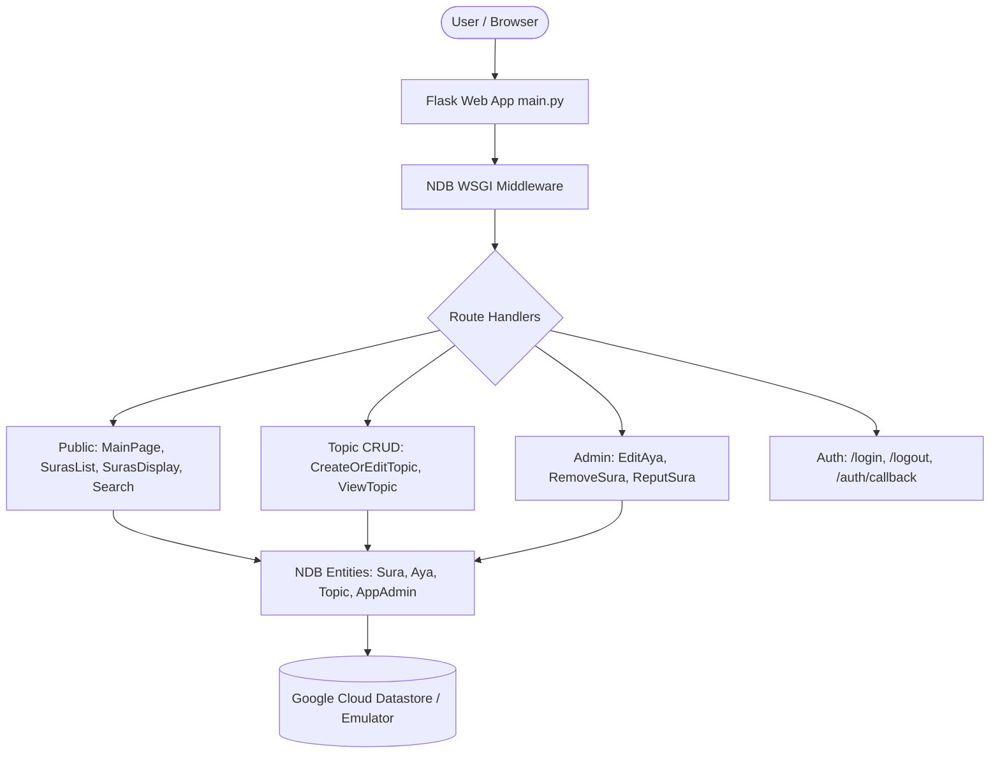
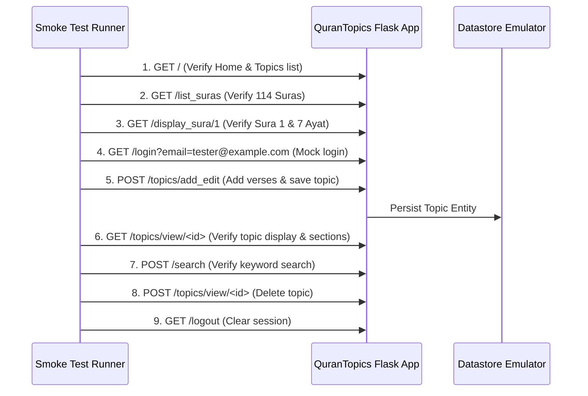

# QuranTopics: Verification & Regression Testing Plan

This document outlines a complete, production-grade strategy to verify all functions of **QuranTopics** before and after performing application changes, dependency updates (e.g., Flask, Authlib, Google Cloud NDB), or Python runtime upgrades.

---

## 1. System Overview & Risk Map

QuranTopics is a Flask 3.0 application designed for Google App Engine (Python 3.11) with Google Cloud Datastore (NDB) and Google OAuth via Authlib.



### High-Risk Regression Points
1. **NDB Context Propagation**: Every database operation requires `with ndb_client.context():`. Framework upgrades (Flask WSGI changes or threading models) can silently detach NDB contexts.
2. **Topic Builder State Machine (`CreateOrEditTopic`)**: Complex form-based state machine handling verse range queries, duplicate filtering, positional array insertion, interactive checkbox removal, reordering, and Datastore key serialization.
3. **Verse Grouping & Section Delimitation (`ViewTopic.make_topic_lines`)**: Consecutive ayat vs non-consecutive verses triggering section headers.
4. **Search Tokenization Hook (`Topic._pre_put_hook`)**: Case folding and tokenization for title queries.
5. **Authorization Matrix (`PageController`)**:
   - **Anonymous**: Read-only public pages. Attempting to add/edit topics redirects to `/login`.
   - **Normal User**: Can create topics; can view, edit, and delete only their own topics.
   - **Admin User (`AppAdmin`)**: Can view, edit, and delete any user's topics; can access `/admin/*`.

---

## 2. Option B: Automated End-to-End Smoke Test Suite

> **Goal**: Rapidly verify the health of the entire live application stack (server + Datastore emulator) with an executable script before touching any code.

### 2.1 Architecture & Flow
The smoke test script runs HTTP requests against `http://localhost:8080` (or a spawned test instance) covering all critical user journeys.



### 2.2 Implementation Details (`scripts/smoke_test.py`)
- **Session Management**: Uses `requests.Session()` to maintain cookies across requests.
- **Mock Authentication**: Exploits dev login bypass (`/login?email=...`) for both regular users and admins.
- **Verification Assertions**:
  - `GET /`: Status 200, checks for Arabic navigation and layout elements.
  - `GET /list_suras`: Status 200, verifies presence of Sura names (الفاتحة, البقرة, etc.).
  - `GET /display_sura/1`: Status 200, verifies all 7 verses of Al-Fatiha appear.
  - `POST /search`: Queries keyword and verifies search results table.
  - `POST /topics/add_edit` (Workflow):
    1. `add`: Submits Sura 1, from_aya 1, to_aya 3.
    2. `save`: Submits title "موضوع تجريبي" and verifies success message "تم حفظ الموضوع".
  - `GET /topics/view/<id>`: Validates correct verse rendering and author edit controls.
  - `POST /topics/view/<id>` (`delete=true`): Verifies topic is deleted and redirects to `/`.
  - `Admin Security Check`: Non-admin trying `/admin/edit_aya?sura=1&aya=1` redirected to `/`.

### 2.3 How to Run Option B
```bash
# 1. Start Datastore / Firestore Emulator (in terminal 1)
firebase --config var/firebase/firebase.json emulators:start --only firestore

# 2. Run Flask application (in terminal 2)
export DATASTORE_EMULATOR_HOST=localhost:8081
./venv/bin/python main.py

# 3. Execute Smoke Test Suite (in terminal 3)
./venv/bin/python scripts/smoke_test.py
```

---

## 3. Option A: Granular Unit & Integration Test Suite (`pytest` + NDB)

> **Goal**: Fast, hermetic, CI-ready automated tests that run without manual server setup and report code coverage across all controllers.

### 3.1 Test Directory Structure
```
tests/
├── __init__.py
├── conftest.py                      # Global fixtures: Flask client, NDB context, seed data
├── unit/
│   ├── __init__.py
│   ├── test_entities.py             # Sura, Aya, Topic, AppAdmin logic & hooks
│   ├── test_view_objects.py         # TopicEditView, section splitting, reordering
│   └── test_authorization.py        # Permissions (anonymous vs owner vs admin)
└── integration/
    ├── __init__.py
    ├── test_public_routes.py        # /, /list_suras, /display_sura/<id>, /search
    ├── test_topic_lifecycle.py      # Add, reorder, delete verse, save, view, delete topic
    ├── test_security_boundaries.py   # Tampering checks (User B editing User A's topic)
    └── test_admin_routes.py         # Edit aya, remove sura, reput sura
```

### 3.2 Key Pytest Fixtures (`tests/conftest.py`)
1. **`ndb_context`**:
   - Connects NDB client to `DATASTORE_EMULATOR_HOST=localhost:8081` (or in-memory mock).
   - Yields clean NDB context for each test:
     ```python
     @pytest.fixture(scope="session")
     def ndb_client():
         os.environ["DATASTORE_EMULATOR_HOST"] = "localhost:8081"
         os.environ["APPLICATION_ID"] = "dev~qurantopics"
         return ndb.Client(project="qurantopics")

     @pytest.fixture(autouse=True)
     def clean_datastore(ndb_client):
         with ndb_client.context():
             yield
             # Clean up test entities after each test
     ```
2. **`seed_data` (Fast Synthetic Fixture)**:
   - Avoids loading all 6,236 verses for every test run.
   - Populates Sura 1 (7 verses), Sura 112 (4 verses), and one `AppAdmin(email='admin@example.com')`.
3. **`client` & `auth_clients`**:
   - `client`: Anonymous Flask test client.
   - `user_client`: Test client with `session['user_email'] = 'user@example.com'`.
   - `admin_client`: Test client with `session['user_email'] = 'admin@example.com'`.

### 3.3 Test Specifications

#### Unit Tests (`tests/unit/`)
* **`test_entities.py`**:
  * `test_topic_pre_put_hook`: Verify `Topic(title="الصبر في القرآن").put()` generates `search_words = ['الصبر', 'في', 'القرآن']`.
  * `test_sura_aya_queries`: Verify `sura.get_ayat_query_in_range(1, 3)` returns exact subset ordered by number.
  * `test_app_admin_is_admin`: Verify `AppAdmin.is_admin('admin@example.com')` is `True`, unknown email is `False`.
* **`test_view_objects.py`**:
  * `test_make_topic_lines_consecutive`: Verses 1, 2, 3 of Sura 1 produce a single section (`new_section=True` only for Aya 1).
  * `test_make_topic_lines_discontinuous`: Verse 1 and Verse 5 produce two separate sections (`new_section=True` on both).
  * `test_make_topic_lines_different_suras`: Transition from Sura 1 Aya 7 to Sura 112 Aya 1 triggers a new section.
  * `test_topic_edit_deduplication`: Adding already present verse is rejected by `list_contains_aya`.
  * `test_topic_edit_positional_insert`: Insert verses at specific index in list.
  * `test_topic_edit_reordering`: `move_selected_to_position` moves checked verses to designated slot.

#### Integration Tests (`tests/integration/`)
* **`test_public_routes.py`**:
  * `test_main_page_renders_topics`: Status 200, checks Jinja context.
  * `test_suras_list`: Verifies 114 suras rendered.
  * `test_display_sura`: Validates route `/display_sura/1`.
  * `test_search_topics`: Searches matching and non-matching terms; verifies search results.
* **`test_topic_lifecycle.py`**:
  * `test_create_topic_requires_login`: Anonymous POST redirects to `/login`.
  * `test_create_topic_validation`: Missing title or empty ayat yields error message.
  * `test_create_topic_success`: Creates topic, saves to NDB, returns topic ID.
  * `test_edit_existing_topic`: Load topic, modify title, save, verify Datastore update.
  * `test_delete_topic`: Send `delete=true` on `/topics/view/<id>`, verify entity removed from NDB.
* **`test_security_boundaries.py`**:
  * `test_user_cannot_edit_other_user_topic`: User B attempting to edit User A's topic raises `UserNotPermittedToPerformOperation` / redirects to `/`.
  * `test_user_cannot_delete_other_user_topic`: User B attempting delete on User A's topic is rejected.
  * `test_admin_can_edit_any_topic`: Admin can edit and delete User A's topic.
* **`test_admin_routes.py`**:
  * `test_admin_edit_aya`: Modifies verse text.
  * `test_admin_delete_aya_prevented_if_used_in_topic`: Validates referential integrity guard.

---

## 4. Implementation Checklist & Phased Roadmap

| Phase | Task | Status / Next Step |
|---|---|---|
| **Phase 1** | **Option B: Smoke Test** | |
| 1.1 | Create `scripts/smoke_test.py` with standalone session runner | Ready to implement |
| 1.2 | Add runner shell script `scripts/run_smoke_tests.sh` | Ready to implement |
| 1.3 | Verify against running local emulator and server | Validation step |
| **Phase 2** | **Option A: Test Framework Setup** | |
| 2.1 | Add `pytest`, `pytest-cov`, `pytest-mock` to `requirements-dev.txt` | Ready to implement |
| 2.2 | Create `pytest.ini` with standard flags and coverage config | Ready to implement |
| 2.3 | Create `tests/conftest.py` with NDB fixtures and test clients | Ready to implement |
| **Phase 3** | **Option A: Unit & Integration Tests** | |
| 3.1 | Implement `tests/unit/test_view_objects.py` & `test_entities.py` | Ready to implement |
| 3.2 | Implement `tests/integration/test_public_routes.py` | Ready to implement |
| 3.3 | Implement `tests/integration/test_topic_lifecycle.py` | Ready to implement |
| 3.4 | Implement `tests/integration/test_security_boundaries.py` | Ready to implement |
| 3.5 | Implement `tests/integration/test_admin_routes.py` | Ready to implement |
| **Phase 4** | **CI & Upgrade Pipeline** | |
| 4.1 | Create `.github/workflows/test.yml` for pull request validation | Ready to implement |
| 4.2 | Document the Upgrade Verification Protocol (below) | Complete |

---

## 5. Upgrade Verification Protocol

When preparing for an upgrade (e.g., Python 3.11 $\rightarrow$ 3.12/3.13, Flask 3.0 $\rightarrow$ 3.1+, or `google-cloud-ndb` update):

1. **Baseline Verification**:
   ```bash
   pytest --cov=controllers --cov-report=term-missing
   ```
   Ensure 100% test pass rate on current versions.
2. **Update Dependencies / Runtime**:
   - Update `app.yaml` runtime or `requirements.txt` package versions.
   - Reinstall dependencies in a fresh virtualenv.
3. **Execute Regression Suite**:
   ```bash
   pytest
   ```
4. **Run Smoke Test against Dev Server**:
   ```bash
   ./scripts/run_smoke_tests.sh
   ```
5. **Inspect NDB Warning Logs**:
   Look for deprecation warnings related to `google.cloud.ndb` context handling or Flask request contexts.
